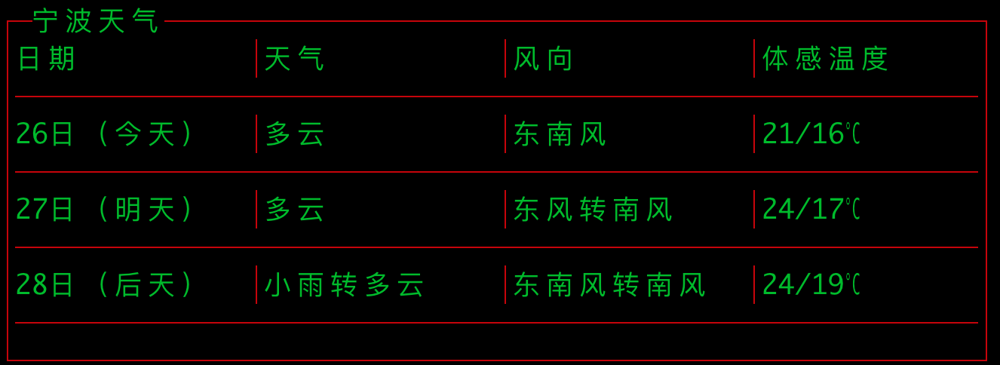

# 命令行查天气小工具

[参考文档](https://m.jb51.net/jiaoben/3112382bm.htm)



## 安装工具

sudo go install github.com/spf13/cobra-cli@latest  

## 建项目

go mod init query  
go get github.com/spf13/cobra@latest  

## 使用

go build  
./query weather 宁波

## FAQ

【fixed】无法安装cobra-cli
```bash
cyd:cobra_tools cyd$ go install github.com/spf13/cobra-cli@latest
github.com/spf13/cobra-cli: go install github.com/spf13/cobra-cli: copying /var/folders/db/tlq2y0sx1xn72jmvnq7ml3kr0000gn/T/go-build459479626/b001/exe/a.out: open /usr/local/go/bin/cobra-cli: permission denied
```
go源码目录没有权限导致
```bash
sudo chown -R cyd:staff go
```